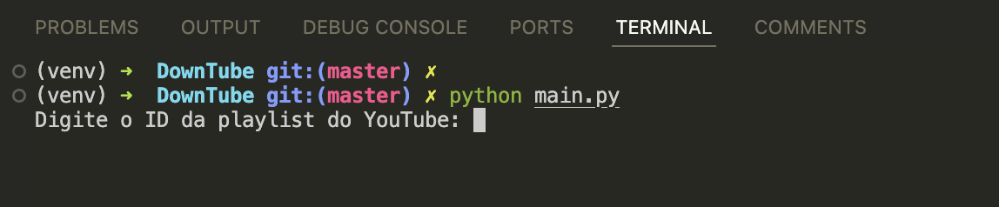

# MCB-DOWNTUBE

Utility developed in Python that allows you to download a YouTube Playlist

## What's done:

- Download Youtube Playlist

## What remains to be finished:

- Dialog-based user interface

##Challenges:

- Progress Bar